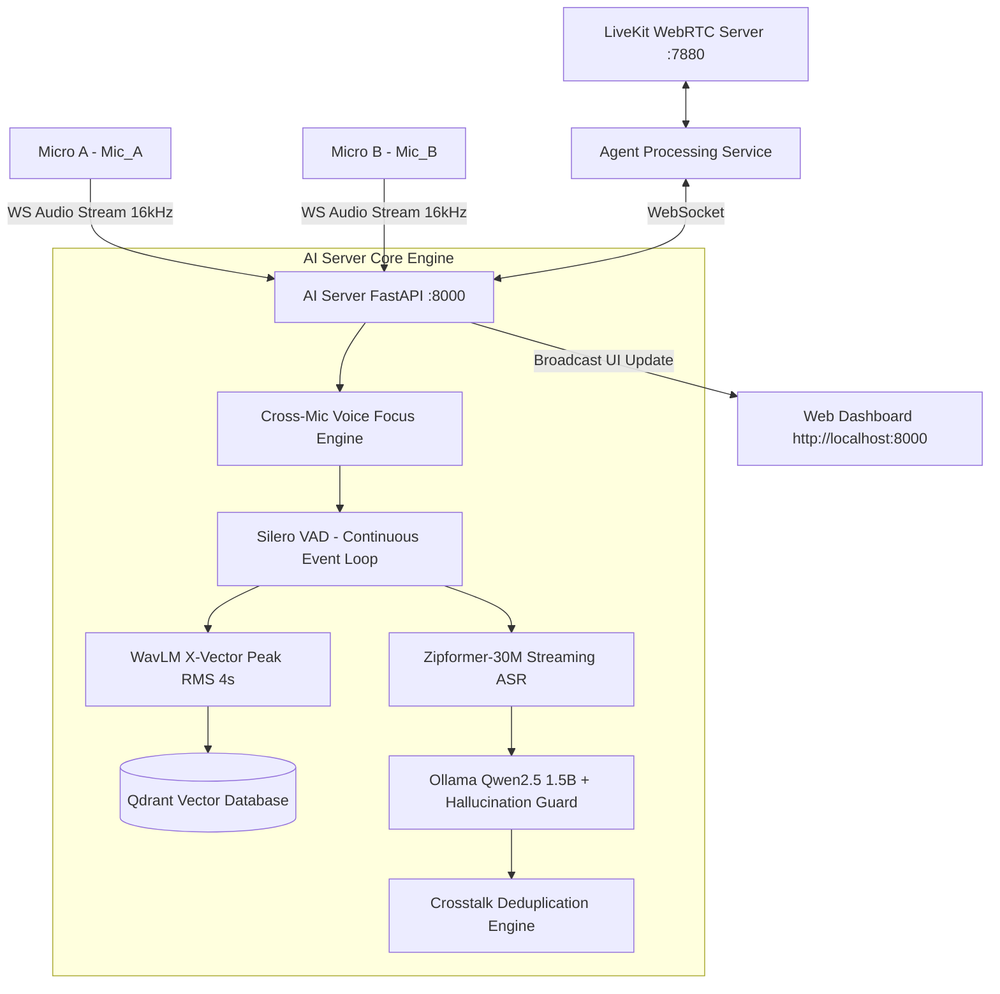

# 🚀 HƯỚNG DẪN VẬN HÀNH & TEST HỆ THỐNG BIÊN BẢN CUỘC HỌP ĐA MICRO (LIVEKIT + AI SERVER + WEB DASHBOARD)

Tài liệu hướng dẫn vận hành hệ thống AI phân biệt giọng nói đa micro thời gian thực (Real-time Multi-Speaker Diarization & Streaming STT Pipeline).

---

## 🏗️ 1. ARCHITECTURE OVERVIEW (KIẾN TRÚC HỆ THỐNG)



---

## ⚡ 2. CÁC TÍNH NĂNG DYNAMIC CHÍNH TRONG PIPELINE MỚI

1. **Dynamic Voice Focus (Cross-Mic Focus)**: So sánh RMS thời gian thực (10ms frame) giữa các Mic. Mic nào to vượt trội sẽ chiếm Focus; Mic lọt âm bị chặn VAD và ép ngắt câu lập tức.
2. **Dynamic Silence & Semantic Endpointing**: Tự động ngắt câu sớm khi ASR hoàn thành ý ngữ nghĩa (kết thúc bằng dấu `.`, `?`, `!` hoặc các từ chốt câu `rồi`, `xong`, `nhé`) kết hợp im lặng nhẹ (>0.4s).
3. **Adaptive Speaker Cosine Threshold**: Tự động đo khoảng cách giữa các vector giọng nói trong DB để nâng/hạ ngưỡng nhận diện (0.75 - 0.92), chống nhầm lẫn người nói.
4. **Adaptive Noise Gate**: Ngưỡng lọc tiếng ồn phông tự điều chỉnh theo môi trường thời gian thực.
5. **Multi-Mic Safety Guards**:
   - **Max Speech Guard (18s)**: Tự động ngắt chốt câu nếu 1 người nói liên tục > 18 giây, tránh khóa luồng Focus 1 Mic.
   - **VAD Resilient Loop**: Tự động tái tạo luồng VAD không mất frame khi câu bị cắt ép.

---

## 🛠️ 3. QUY TRÌNH VẬN HÀNH (KỊCH BẢN 3 TAB TERMINAL)

### 🖥️ TAB 1: Dịch vụ Nền (LiveKit Server & Ollama LLM)
```bash
# 1. Bật LiveKit Server (chạy ngầm)
livekit-server --dev > livekit.log 2>&1 &

# 2. Kiểm tra máy chủ Ollama Qwen2.5 đã sẵn sàng
ollama run qwen2.5:1.5b
```

### 🧠 TAB 2: Khởi động AI Server & Web Dashboard (Port 8000)
```bash
cd /mnt/d/VNPT/Code/Multi_Speaker_Streaming
source venv_linux/bin/activate

# Khởi chạy AI Core Server & Web Dashboard
python ai_server.py
```
👉 *Chờ nạp xong các model (Zipformer, WavLM, Silero VAD, Qdrant). Màn hình sẽ báo: **`🚀 Khởi chạy AI Server & Web Dashboard tại http://localhost:8000`**.*

### 🎙️ TAB 3: Khởi chạy LiveKit Agent & Mô phỏng Test

**Cách A: Chạy LiveKit Agent & Script Mô phỏng từ Terminal**
```bash
# Tab 3a: Khởi chạy Agent kết nối LiveKit với AI Server
source venv_linux/bin/activate
python agent.py

# Tab 3b: Bơm dữ liệu mô phỏng 2 Micro trong phòng họp
source venv_linux/bin/activate
python test_client.py
```

**Cách B: Test 1-Click từ Web Dashboard UI (Khuyên dùng)**
1. Mở trình duyệt truy cập: `http://localhost:8000`
2. Đăng ký vân tay giọng nói (Enroll) file audio hoặc dùng các nút nhanh.
3. Bấm nút **"🚀 Khởi Chạy Mô Phỏng 2 Micro"** trên giao diện Web để bắt đầu test tự động!

---

## 👁️ 4. QUAN SÁT & KẾT QUẢ NGHIỆM THU

1. **Giao diện Web Dashboard (`http://localhost:8000`)**:
   - Hiển thị danh sách diễn giả đã enroll & Chỉ số tương đồng vector (`Speaker Similarity`).
   - Màn hình **Biên bản Cuộc họp Chính thức (Official Minutes)** hiển thị dạng Timeline thực tế (Ai nói gì, lúc mấy giây).
   - Màn hình **Nói Nháp (Live Partial Transcript)** nhảy chữ thời gian thực theo từng Mic.
2. **Terminal AI Server (`ai_server.py`)**:
   - Theo dõi Log `[🎙️ VAD] [Mic_A] BẮT ĐẦU NÓI...`
   - Log `[WavLM] Top 1: thay_Dung (0.943)` xác định đúng diễn giả.
   - Log `[🧠 Semantic Cut]` hoặc `[⏳ Max Timeout]` thể hiện cơ chế ngắt câu linh hoạt.
   - Log `[✅ Đã gửi Biên Bản]` hoàn tất luồng xử lý.
